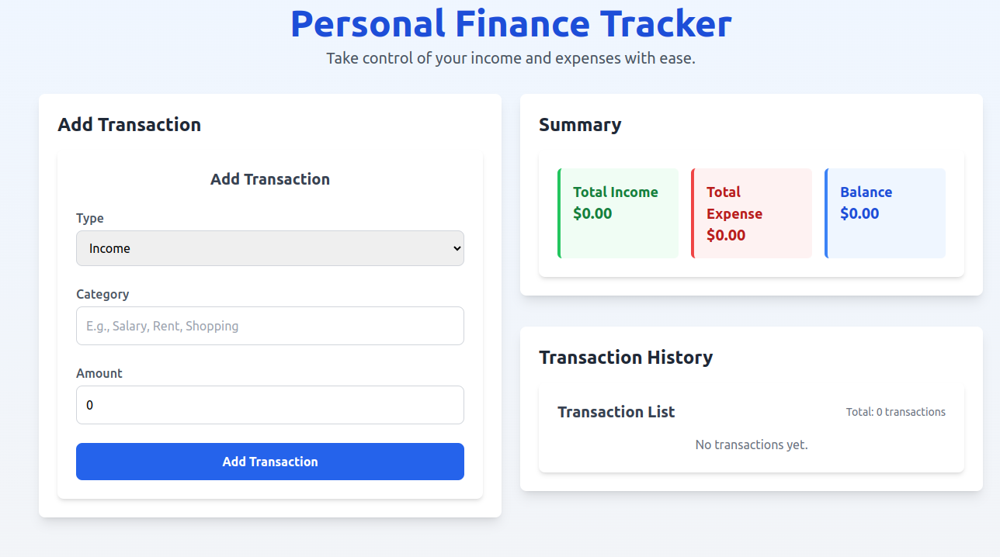

# Personal Finance Tracker

A modern and user-friendly web application designed to help you track your income and expenses. Categorize transactions, monitor your financial health, and gain insights into your balance with an intuitive interface.

---

## **Features**

- **Add Transactions**: Input forms to record income and expenses.
- **Categorization**: Organize transactions into "Income" or "Expense" categories.
- **View Summary**: Get a clear summary of total income, expenses, and balance.
- **Manage Transactions**: Edit or delete any recorded transactions easily.
- **Responsive Design**: Optimized for all devices, from mobile to desktop.
- **Data Persistence**: Transactions are saved using browser local storage.

---

## **Technologies Used**

- **Frontend**: React, TypeScript
- **Styling**: Tailwind CSS
- **State Management**: React Hooks
- **Data Persistence**: Local Storage API

---

## **Getting Started**

### **Prerequisites**
Make sure you have the following installed:
- Node.js (v16 or later)
- npm or yarn package manager

### **Installation**

1. Clone the repository:
   ```bash
   git clone https://github.com/your-username/personal-finance-tracker.git
   cd personal-finance-tracker
   ```

2. Install dependencies:
   ```bash
   npm install
   # or
   yarn install
   ```

3. Start the development server:
   ```bash
   npm run dev
   # or
   yarn dev
   ```

4. Open your browser and navigate to:
   ```
   http://localhost:3000
   ```

---

## **Project Structure**

```
📂 src
├── 📂 components
│   ├── TransactionForm.tsx      # Form to add transactions
│   ├── TransactionList.tsx      # Displays list of transactions
│   └── Summary.tsx              # Displays income, expense, and balance summary
├── 📂 hooks
│   └── useLocalStorage.ts       # Custom hook for local storage management
├── 📂 schema
│   └── type.ts                  # TypeScript type definitions for transactions
├── App.tsx                      # Main app component
└── index.tsx                    # Entry point for React app
```

---

## **Usage**

1. **Add Transactions**:
   - Choose a transaction type (Income or Expense).
   - Enter a category (e.g., Salary, Groceries).
   - Specify the amount.
   - Click "Add Transaction" to save.

2. **View Summary**:
   - Check the "Summary" section for total income, expenses, and your current balance.

3. **Manage Transactions**:
   - View your transaction history in the "Transaction History" section.
   - Delete a transaction by clicking the "Delete" button next to it.

---

## **Screenshots**

### **Home Page**
> A visually pleasing and responsive layout for adding transactions, viewing a summary, and managing transaction history.


---

## **Future Enhancements**

- Add a feature to edit transactions.
- Implement date filtering for transactions.
- Integrate with a backend to enable multi-device syncing.
- Provide visual analytics using charts and graphs.

---

## **License**

This project is licensed under the [MIT License](LICENSE).

---

## **Contact**

Created by [Arnaud](https://github.com/ArnaudBand).  
Feel free to reach out for collaboration or feedback!